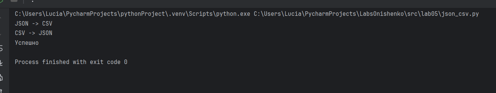
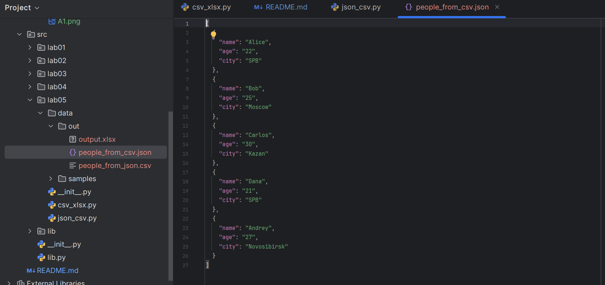
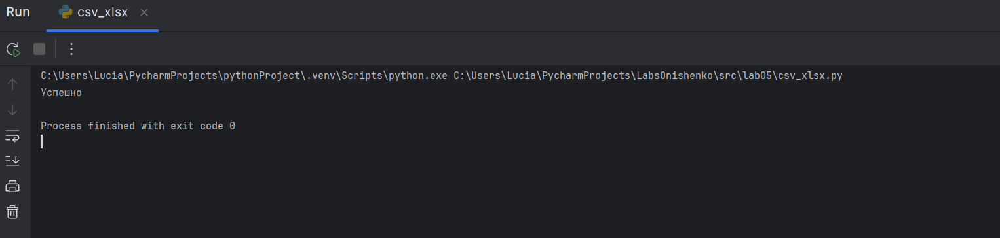
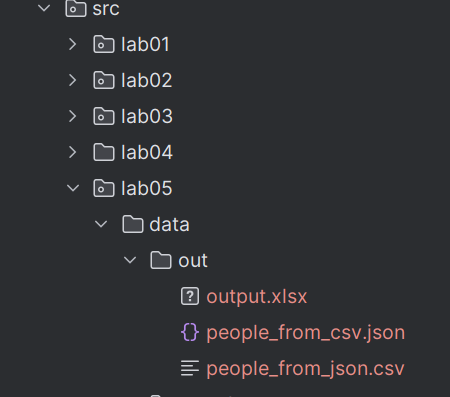
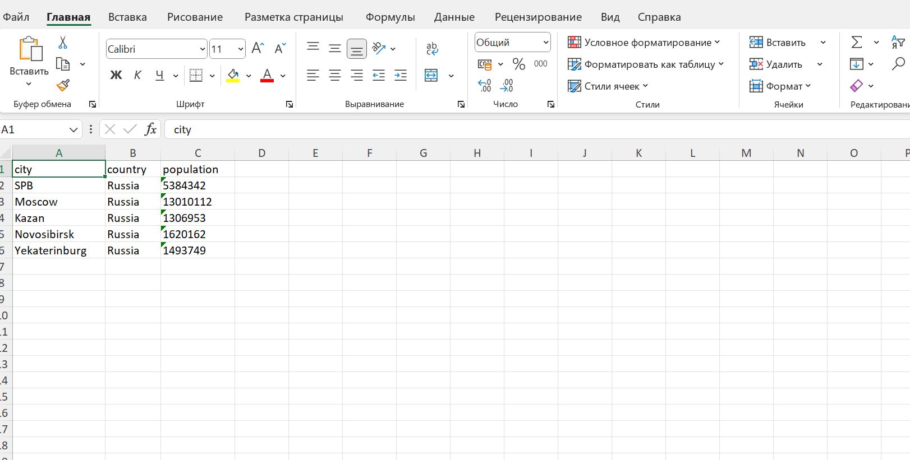
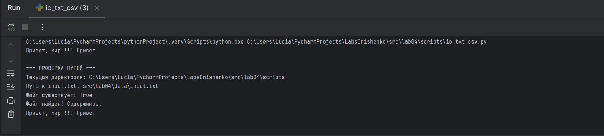
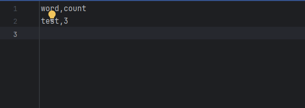
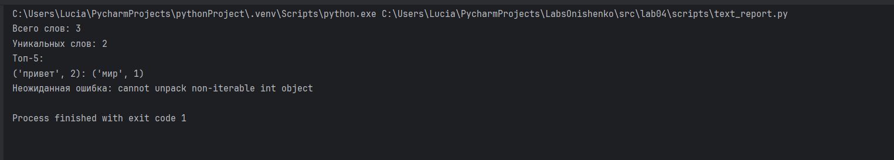
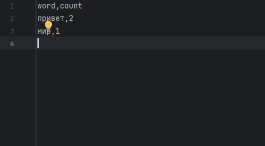

# Лабораторная работа 5
## задание A JSON_CSV
```python
import json
import csv
import os
from typing import List, Dict, Any


def validate_json_file(json_path: str) -> List[Dict[str, Any]]:
    if not os.path.exists(json_path):
        raise FileNotFoundError(f"JSON файл не найден: {json_path}")
    if os.path.getsize(json_path) == 0:
        raise ValueError(f"JSON файл пустой: {json_path}")
    with open(json_path, 'r', encoding='utf-8') as json_file:
        data = json.load(json_file)
    if not isinstance(data, list):
        raise ValueError(f"JSON должен содержать список на верхнем уровне. Получен: {type(data)}")

    if len(data) == 0:
        raise ValueError(f"JSON файл содержит пустой список: {json_path}")

    if not all(isinstance(item, dict) for item in data):
        raise ValueError("Все элементы JSON должны быть словарями")

    return data


def validate_csv_file(csv_path: str) -> List[str]:
    if not os.path.exists(csv_path):
        raise FileNotFoundError(f"CSV файл не найден: {csv_path}")

    if os.path.getsize(csv_path) == 0:
        raise ValueError(f"CSV файл пустой: {csv_path}")

    with open(csv_path, 'r', encoding='utf-8') as csv_file:
        reader = csv.reader(csv_file)
        headers = next(reader, None)

        if headers is None:
            raise ValueError(f"CSV файл не содержит заголовков: {csv_path}")

        if not headers:
            raise ValueError(f"CSV файл содержит пустые заголовки: {csv_path}")

    return headers


def json_to_csv(json_path: str, csv_path: str) -> None:
    data = validate_json_file(json_path)
    output_dir = os.path.dirname(csv_path)
    if output_dir:
        os.makedirs(output_dir, exist_ok=True)

    all_keys = set()
    for item in data:
        all_keys.update(item.keys())

    fieldnames = sorted(all_keys)

    with open(csv_path, 'w', encoding='utf-8', newline='') as csv_file:
        writer = csv.DictWriter(csv_file, fieldnames=fieldnames)

        writer.writeheader()

        for item in data:
            row = {key: str(item.get(key, '')) for key in fieldnames}
            writer.writerow(row)


def csv_to_json(csv_path: str, json_path: str) -> None:
    validate_csv_file(csv_path)

    output_dir = os.path.dirname(json_path)
    if output_dir:
        os.makedirs(output_dir, exist_ok=True)

    data = []

    with open(csv_path, 'r', encoding='utf-8') as file:
        reader = csv.DictReader(file)

        for row in reader:
            data.append(dict(row))

    with open(json_path, 'w', encoding='utf-8') as file:
        json.dump(data, file, ensure_ascii=False, indent=2)


if __name__ == "__main__":
    samples_path = 'data/samples'
    out_path = 'data/out'

    test_cases = [
        (json_to_csv, f'{samples_path}/people.json', f'{out_path}/people_from_json.csv', "Нормальный JSON → CSV"),
        (csv_to_json, f'{samples_path}/people.csv', f'{out_path}/people_from_csv.json', "Нормальный CSV → JSON"),
    ]

    os.makedirs(out_path, exist_ok=True)

    for func, input_file, output_file, description in test_cases:

        try:
            func(input_file, output_file)
        except FileNotFoundError:
            print("FileNotFoundError")
        except ValueError:
            print("ValueError")

    try:
        print("JSON -> CSV")
        json_to_csv(f'{samples_path}/people.json', f'{out_path}/people_from_json.csv')

        print("CSV -> JSON")
        csv_to_json(f'{samples_path}/people.csv', f'{out_path}/people_from_csv.json')

    except FileNotFoundError:
        print("FileNotFoundError")
    except ValueError:
        print("ValueError")
    finally:
        print("Успешно")
```



## задание В CSV_XLSX
```python
import csv
import os
from pathlib import Path
from openpyxl import Workbook
from openpyxl.utils import get_column_letter


def csv_to_xlsx(csv_path: str, xlsx_path: str) -> None:
    if not os.path.exists(csv_path):
        raise FileNotFoundError(f"Файл не найден: {csv_path}")

    if os.path.getsize(csv_path) == 0:
        raise ValueError("CSV файл пуст")

    workbook = Workbook()
    sheet = workbook.active
    sheet.title = "Sheet1"

    with open(csv_path, 'r', encoding='utf-8') as file:
        csv_reader = csv.reader(file)
        rows = list(csv_reader)

    if not rows:
        raise ValueError("CSV файл не содержит данных")

    for row_idx, row in enumerate(rows, 1):
        for col_idx, value in enumerate(row, 1):
            sheet.cell(row=row_idx, column=col_idx, value=value)

    for column_cells in sheet.columns:
        max_length = 0
        column_letter = get_column_letter(column_cells[0].column)

        for cell in column_cells:
            try:
                if cell.value:
                    max_length = max(max_length, len(str(cell.value)))
            except:
                pass

        adjusted_width = max(max_length + 2, 8)
        sheet.column_dimensions[column_letter].width = adjusted_width

    workbook.save(xlsx_path)


if __name__ == "__main__":
    try:
        csv_path = Path("data/samples/cities.csv")
        xslx_path = Path("data/out/output.xlsx")
        csv_to_xlsx(csv_path, xslx_path)
        print("Успешно")
    except (ValueError, FileNotFoundError) as e:
        print(f"Ошибка: {e}")
```






# Лабораторная работа 4
## io_txt_csv.py
```python
from pathlib import Path
import csv


def read_text(path, encoding="utf-8"):
    path = Path(path)

    with open(path, "r", encoding=encoding) as file:
        return file.read()


def write_csv(
    rows,
    path,
    header=None,
):
    path = Path(path)

    if rows:
        first_length = len(rows[0])
        for row in rows:
            if len(row) != first_length:
                raise ValueError(
                    f"Строка имеет длину {len(row)}, ожидалось {first_length}"
                )

    if header and rows:
        if len(header) != len(rows[0]):
            raise ValueError(
                f"Заголовок имеет длину {len(header)}, а строки - {len(rows[0])}"
            )

    ensure_parent_dir(path)

    with open(path, "w", newline="", encoding="utf-8") as file:
        writer = csv.writer(file, delimiter=",")

        if header:
            writer.writerow(header)

        writer.writerows(rows)


def ensure_parent_dir(path):
    path = Path(path)
    parent_dir = path.parent
    parent_dir.mkdir(parents=True, exist_ok=True)


try:
    content = read_text("src/lab04/data/input.txt", encoding="utf-8")
    print(content)
except FileNotFoundError:
    print("FileNotFoundError: Файл не найден")
except UnicodeDecodeError:
    print("UnicodeDecodeError: Ошибка кодировки")

write_csv([("test", 3)], "src/lab04/output/check.csv", header=("word", "count"))

print("=== ПРОВЕРКА ПУТЕЙ ===")
print(f"Текущая директория: {Path.cwd()}")

input_path = Path("src/lab04/data/input.txt")
print(f"Путь к input.txt: {input_path}")
print(f"Файл существует: {input_path.exists()}")

# Проверяем чтение
try:
    content = read_text("src/lab04/data/input.txt", encoding="utf-8")
    print("Файл найден! Содержимое:")
    print(content)
except FileNotFoundError:
    print("FileNotFoundError: Файл не найден")

    # Создаем тестовый файл
    print("Создаю тестовый файл...")
    ensure_parent_dir(input_path)
    with open(input_path, "w", encoding="utf-8") as f:
        f.write("Привет, мир, привет !!!\n")
    print(f"Файл создан: {input_path}")


```



## text_report
```python
import sys
import os
from pathlib import Path

sys.path.insert(0, os.path.dirname(os.path.dirname(os.path.dirname(__file__))))

import sys
sys.path.append(r'C:\Users\Lucia\PycharmProjects\LabsOnishenko\src')

from lib.text import normalize, tokenize, count_freq, top_n

def read_input_file(file_path):
    if not file_path.exists():
        raise FileNotFoundError(f"Входной файл не найден: {file_path}")

    with open(file_path, "r", encoding="utf-8") as file:
        return file.read()


def write_report_csv(frequencies, output_path):
    sorted_items = sorted(frequencies.items(), key=lambda x: (-x[1], x[0]))

    with open(output_path, "w", encoding="utf-8") as file:
        file.write("word,count\n")

        for word, count in sorted_items:
            file.write(f"{word},{count}\n")


def print_summary(tokens, frequencies, top_n):
    print(f"Всего слов: {len(tokens)}")
    print(f"Уникальных слов: {len(frequencies)}")
    print("Топ-5:")

    for word, count in (top_n, 1):
        print(f"{word}: {count}")


def main():
    input_path = Path("src/lab04/data/input.txt")
    output_path = Path("src/lab04/output/report.csv")

    try:
        text = read_input_file(input_path)

        normalized_text = normalize(text)
        tokens = tokenize(normalized_text)
        frequencies = count_freq(tokens)
        top_5 = top_n(frequencies, 5)

        write_report_csv(frequencies, output_path)

        print_summary(tokens, frequencies, top_5)

    except FileNotFoundError as e:
        print(f"Ошибка: {e}")
        print("Убедитесь, что файл data/input.txt существует")
        sys.exit(1)
    except Exception as e:
        print(f"Неожиданная ошибка: {e}")
        sys.exit(1)


if __name__ == "__main__":
    main()
```


# Лабораторная работа 3
## Задание А функция 1
```python
import re
text = '  двойные   пробелы  '
def normalize(text: str, *, casefold: bool = True, yo2e: bool = True) -> str:
    if casefold:
        text = text.casefold()
    if yo2e:
        text = text.replace("ё","е").replace("Ё","Е")
    text = text.replace("\r"," ").replace("\t"," ")
    text = text.strip()
    text = text.split()
    text = " ".join(text)
    return text
text1 = normalize(text)
print(text1)
```
## Тест-кейсы к 1 функции


## Задание А функция 2
```python
import re
text1="emoji 😀 не слово"
def tokenize(text: str) -> list[str]:
    return re.findall("[\w-]+", text)
text2 = tokenize(text1)
print(text2)
```
## Тест-кейсы ко 2 функции


## Задание A функции 3-4
```python
text2 = ["bb","aa","bb","aa","cc"]


def count_freq(tokens: list[str]) -> dict[str, int]:
    result = {}
    for token in tokens:
        result[token] = result.get(token, 0) + 1
    return result


text3 = count_freq(text2)


def top_n(freq: dict[str, int], n: int = 5) -> list[tuple[str, int]]:
    result = []
    for key in freq:
        value = freq[key]
        element = (key, value)
        result.append(element)


    result = sorted(result, key=lambda p: p[0])[:n]

    return result


text4 = top_n(text3)
print(text4)
print(input())

```
## Тест-кейсы к функциям 3-4


## Задание В
```python
import sys
import io

# Принудительная настройка кодировки для Windows PowerShell для Кириллицы
if sys.platform == "win32":
    sys.stdin = io.TextIOWrapper(sys.stdin.buffer, encoding='utf-8')

import sys
sys.path.append(r'C:\Users\Lucia\PycharmProjects\LabsOnishenko\src')

from lib.text import normalize, tokenize, count_freq, top_n
import re

a = sys.stdin.read().strip()
norm = normalize(a)
token = tokenize(norm)
print("Всего слов:", len(token))
count = count_freq(token)
print("Уникальных слов:", len(count))
top = top_n(count)
print("Топ-5:")

for element in top[:5]:  
    print(element[0], ":", element[1])
```


# Лабораторная работа 2


## Задание 1 пункт 3
```python
mat = [[1, 2], [3, 4]]
def flatten(mat):
    new_mat = []
    for num in mat:
        if type(num) == tuple or type(num) == list:
            for i in range(len(num)):
                if num[i] != '':
                    new_mat.append(num[i])
        else:
            raise ValueError
    print(new_mat)
flatten(mat)
```


## Задание B пункт 1
```python
mat= [[1, 2], [3, 4]]

def check_rvanost(mat):
    dlina = len(mat[-1])
    for x in mat:
        if len(x) != dlina:
            raise ValueError
        else:
            return True
def transpose(mat):
    if check_rvanost:
        new_mat = []
        for stolbec in range(len(mat[-1])):
            new_row = []
            for row in range(len(mat)):
                new_row.append(mat[row][stolbec])
            new_mat.append(new_row)
    print(new_mat)
transpose(mat)
```


## Задание B пункт 2
```python
mat = [[1, 2], [3, 4]]
def check_rvanost(mat):
    for i in range(len(mat)):
        if len(mat[i]) == len(mat[i+1]):
            return True
        else:
            return False
def row_sums(mat):
    new_mat = []
    for x in mat:
        if type(x) == list and check_rvanost(mat):
            summa = 0
            for i in range(len(x)):
                summa += x[i]
            new_mat.append(summa)
        else:
            raise ValueError
    print(new_mat)
row_sums(mat)
```


## Задание B пункт 3
```python
mat = [[1, 2, 3], [4, 5, 6]]# Лабораторная работа 2
## Задание 1 пункт 1
```python
nums = [1,2,3,4]
def min_max(nums):
    a = []
    if len(nums) > 0:
        minn = a.append(min(nums))
        maxx = a.append(max(nums))
        print(tuple(a))
    else:
        raise ValueError
min_max(nums)
```


## Задание 1 пункт 2
```python
nums = [3,1,2,1,3]
def unique_sorted(nums):
    new_nums = sorted(set(nums))
    print(new_nums)
unique_sorted(nums)

```


## Задание 1 пункт 3
```python
mat = [[1, 2], [3, 4]]
def flatten(mat):
    new_mat = []
    for num in mat:
        if type(num) == tuple or type(num) == list:
            for i in range(len(num)):
                if num[i] != '':
                    new_mat.append(num[i])
        else:
            raise ValueError
    print(new_mat)
flatten(mat)
```


## Задание B пункт 1
```python
mat= [[1, 2], [3, 4]]

def check_rvanost(mat):
    dlina = len(mat[-1])
    for x in mat:
        if len(x) != dlina:
            raise ValueError
        else:
            return True
def transpose(mat):
    if check_rvanost:
        new_mat = []
        for stolbec in range(len(mat[-1])):
            new_row = []
            for row in range(len(mat)):
                new_row.append(mat[row][stolbec])
            new_mat.append(new_row)
    print(new_mat)
transpose(mat)
```


## Задание B пункт 2
```python
mat = [[1, 2], [3, 4]]
def check_rvanost(mat):
    for i in range(len(mat)):
        if len(mat[i]) == len(mat[i+1]):
            return True
        else:
            return False
def row_sums(mat):
    new_mat = []
    for x in mat:
        if type(x) == list and check_rvanost(mat):
            summa = 0
            for i in range(len(x)):
                summa += x[i]
            new_mat.append(summa)
        else:
            raise ValueError
    print(new_mat)
row_sums(mat)
```


## Задание B пункт 3
```python
mat = [[1, 2, 3], [4, 5, 6]]
def col_sums(mat):
    result = []
    max_length_row = max([len(row) for row in mat])

    try:
        for i in range(max_length_row):
            count = 0
            for row in mat:
                count += row[i]
            result.append(count)
    except:
        raise ValueError("рваная")
    return result
print(col_sums(mat))
```


## Задание C
```python
rec = ("сидорова  анна сергеевна", "ABB-01", 3.999)

def fio(res):
    part = rec[0].split()
    if not part:
        raise ValueError("FIO is empty")
    init = ''.join(l[0].upper() for l in part[1:])
    surn = part[0][0].upper() + part[0][1:]
    return f"{surn} {'.'.join(init)}."

def gpa(rec):
    gp = rec[2]
    if not gp:
        raise ValueError("GPA is empty")
    else:
        return round(rec[2], 2)


def formatRec(rec):
    if len(rec) != 3:
        raise ValueError("Wrong data")
    else:
        name = fio(rec)
        gr = rec[1]
        if not gr:
            raise ValueError("Group is empty")
        gp = gpa(rec)
        print(f"{name}, гр. {gr}, GPA: {gp}")

formatRec(rec)
```


# Лабораторная работа 1
## №1
```python
a = input('')
b = int(input(''))
c = b + 1
print('Имя:', a)
print('Возраст:',b)
print('Привет,',a,'! Через год тебе будет', c, '.')
```


## №2
```python
a = input("a: ").replace(',', '.')
b = input("b: ").replace(',', '.')
c = float(a)
d = float(b)
sum_result = c + d
avg_result = (c + d) / 2
print(f"sum={sum_result:.2f}; avg={avg_result:.2f}")
```


## №3
```python
price = int(input())
discount = int(input())
vat = int(input())
base = price * (1 - discount/100)
vat_amount = base * (vat/100)
total = base + vat_amount
print('База после скидки:',base)
print('НДС',vat_amount)
print('Итого к оплате:',total)
```


## №4
```python
a = int(input('Минуты:'))
b = a//60
c = a % 60
print(b,':',c)
```


## №5
```python
a = input("ФИО: ").strip()
b = ' '.join(a.split())
c = ''.join(word[0].upper() for word in b.split())
d = len(b)
print("Инициалы:",c)
print("Длина (символов):",d)
```

