# Лабораторная работа 3
## Задание А функция 1
```python
import re
text = '  двойные   пробелы  '
def normalize(text: str, *, casefold: bool = True, yo2e: bool = True) -> str:
    if casefold:
        text = text.casefold()
    if yo2e:
        text = text.replace("ё","е").replace("Ё","Е")
    text = text.replace("\r"," ").replace("\t"," ")
    text = text.strip()
    text = text.split()
    text = " ".join(text)
    return text
text1 = normalize(text)
print(text1)
```
## Тест 1

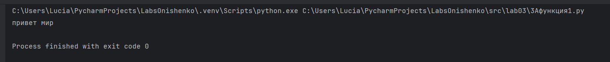

## Тест 2


## Тест 3


## Тест 4


## Задание А функция 2
```python
import re
text1="emoji 😀 не слово"
def tokenize(text: str) -> list[str]:
    return re.findall("[\w-]+", text)
text2 = tokenize(text1)
print(text2)
```
## Тест 1


## Тест 2


## Тест 3


## Тест 4


## Тест 5


## Задание
```python


```


## Задание В
```python
import sys
from text import normalize, tokenize, count_freq, top_n
import re
a = sys.stdin.read().strip()
norm = normalize(a)
token = tokenize(norm)
print("Всего слов:", len(token))
count = count_freq(token)
print("Уникальных слов:", len(count))
top = top_n(count)
print("Топ-5:")

for element in top:
    print(element[0], ":", element[1])


```
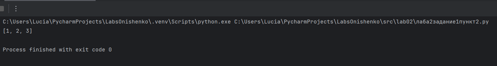

## Задание 1 пункт 3
```python
mat = [[1, 2], [3, 4]]
def flatten(mat):
    new_mat = []
    for num in mat:
        if type(num) == tuple or type(num) == list:
            for i in range(len(num)):
                if num[i] != '':
                    new_mat.append(num[i])
        else:
            raise ValueError
    print(new_mat)
flatten(mat)
```
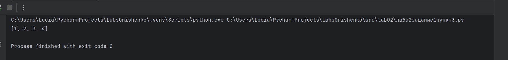

## Задание B пункт 1
```python
mat= [[1, 2], [3, 4]]

def check_rvanost(mat):
    dlina = len(mat[-1])
    for x in mat:
        if len(x) != dlina:
            raise ValueError
        else:
            return True
def transpose(mat):
    if check_rvanost:
        new_mat = []
        for stolbec in range(len(mat[-1])):
            new_row = []
            for row in range(len(mat)):
                new_row.append(mat[row][stolbec])
            new_mat.append(new_row)
    print(new_mat)
transpose(mat)
```
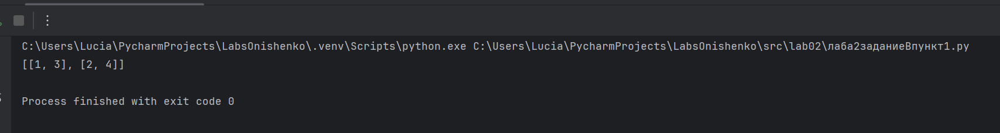

## Задание B пункт 2
```python
mat = [[1, 2], [3, 4]]
def check_rvanost(mat):
    for i in range(len(mat)):
        if len(mat[i]) == len(mat[i+1]):
            return True
        else:
            return False
def row_sums(mat):
    new_mat = []
    for x in mat:
        if type(x) == list and check_rvanost(mat):
            summa = 0
            for i in range(len(x)):
                summa += x[i]
            new_mat.append(summa)
        else:
            raise ValueError
    print(new_mat)
row_sums(mat)
```
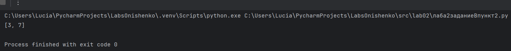

## Задание B пункт 3
```python
mat = [[1, 2, 3], [4, 5, 6]]# Лабораторная работа 2
## Задание 1 пункт 1
```python
nums = [1,2,3,4]
def min_max(nums):
    a = []
    if len(nums) > 0:
        minn = a.append(min(nums))
        maxx = a.append(max(nums))
        print(tuple(a))
    else:
        raise ValueError
min_max(nums)
```
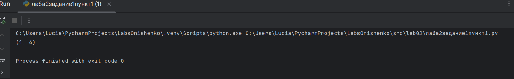

## Задание 1 пункт 2
```python
nums = [3,1,2,1,3]
def unique_sorted(nums):
    new_nums = sorted(set(nums))
    print(new_nums)
unique_sorted(nums)

```


## Задание 1 пункт 3
```python
mat = [[1, 2], [3, 4]]
def flatten(mat):
    new_mat = []
    for num in mat:
        if type(num) == tuple or type(num) == list:
            for i in range(len(num)):
                if num[i] != '':
                    new_mat.append(num[i])
        else:
            raise ValueError
    print(new_mat)
flatten(mat)
```


## Задание B пункт 1
```python
mat= [[1, 2], [3, 4]]

def check_rvanost(mat):
    dlina = len(mat[-1])
    for x in mat:
        if len(x) != dlina:
            raise ValueError
        else:
            return True
def transpose(mat):
    if check_rvanost:
        new_mat = []
        for stolbec in range(len(mat[-1])):
            new_row = []
            for row in range(len(mat)):
                new_row.append(mat[row][stolbec])
            new_mat.append(new_row)
    print(new_mat)
transpose(mat)
```


## Задание B пункт 2
```python
mat = [[1, 2], [3, 4]]
def check_rvanost(mat):
    for i in range(len(mat)):
        if len(mat[i]) == len(mat[i+1]):
            return True
        else:
            return False
def row_sums(mat):
    new_mat = []
    for x in mat:
        if type(x) == list and check_rvanost(mat):
            summa = 0
            for i in range(len(x)):
                summa += x[i]
            new_mat.append(summa)
        else:
            raise ValueError
    print(new_mat)
row_sums(mat)
```


## Задание B пункт 3
```python
mat = [[1, 2, 3], [4, 5, 6]]
def col_sums(mat):
    result = []
    max_length_row = max([len(row) for row in mat])

    try:
        for i in range(max_length_row):
            count = 0
            for row in mat:
                count += row[i]
            result.append(count)
    except:
        raise ValueError("рваная")
    return result
print(col_sums(mat))
```
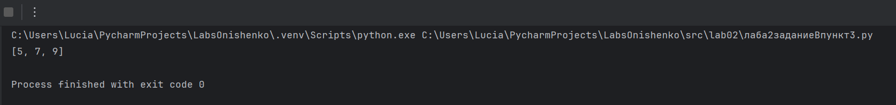

## Задание C
```python
rec = ("сидорова  анна сергеевна", "ABB-01", 3.999)

def fio(res):
    part = rec[0].split()
    if not part:
        raise ValueError("FIO is empty")
    init = ''.join(l[0].upper() for l in part[1:])
    surn = part[0][0].upper() + part[0][1:]
    return f"{surn} {'.'.join(init)}."

def gpa(rec):
    gp = rec[2]
    if not gp:
        raise ValueError("GPA is empty")
    else:
        return round(rec[2], 2)


def formatRec(rec):
    if len(rec) != 3:
        raise ValueError("Wrong data")
    else:
        name = fio(rec)
        gr = rec[1]
        if not gr:
            raise ValueError("Group is empty")
        gp = gpa(rec)
        print(f"{name}, гр. {gr}, GPA: {gp}")

formatRec(rec)
```


# Лабораторная работа 1
## №1
```python
a = input('')
b = int(input(''))
c = b + 1
print('Имя:', a)
print('Возраст:',b)
print('Привет,',a,'! Через год тебе будет', c, '.')
```
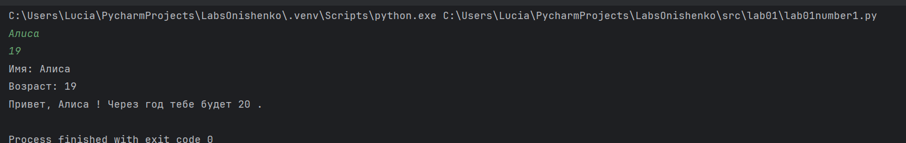

## №2
```python
a = input("a: ").replace(',', '.')
b = input("b: ").replace(',', '.')
c = float(a)
d = float(b)
sum_result = c + d
avg_result = (c + d) / 2
print(f"sum={sum_result:.2f}; avg={avg_result:.2f}")
```
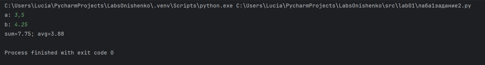

## №3
```python
price = int(input())
discount = int(input())
vat = int(input())
base = price * (1 - discount/100)
vat_amount = base * (vat/100)
total = base + vat_amount
print('База после скидки:',base)
print('НДС',vat_amount)
print('Итого к оплате:',total)
```
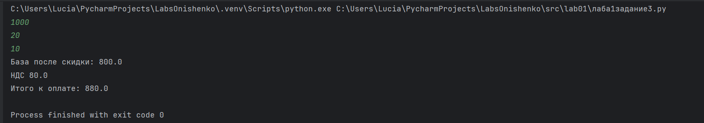

## №4
```python
a = int(input('Минуты:'))
b = a//60
c = a % 60
print(b,':',c)
```
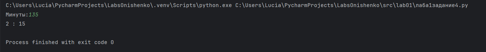

## №5
```python
a = input("ФИО: ").strip()
b = ' '.join(a.split())
c = ''.join(word[0].upper() for word in b.split())
d = len(b)
print("Инициалы:",c)
print("Длина (символов):",d)
```
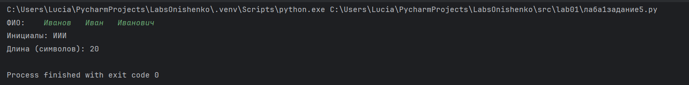
